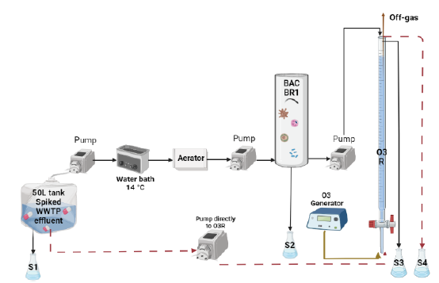
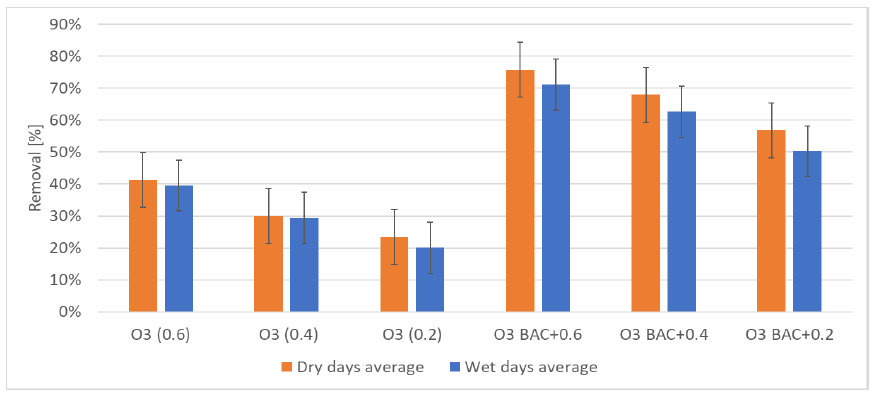
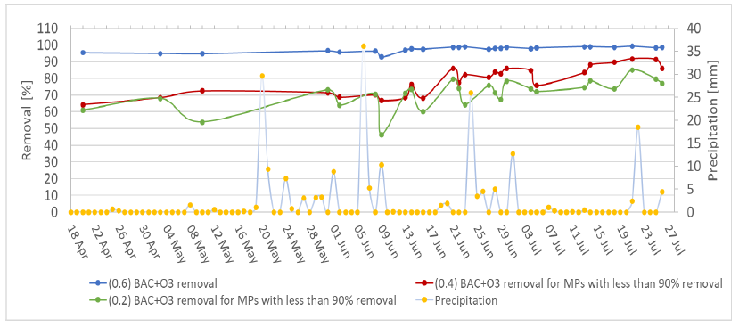
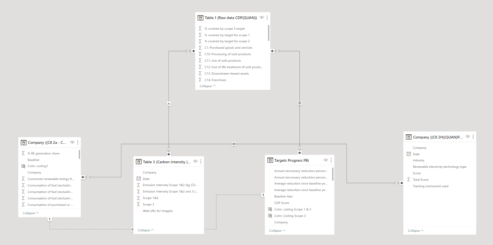
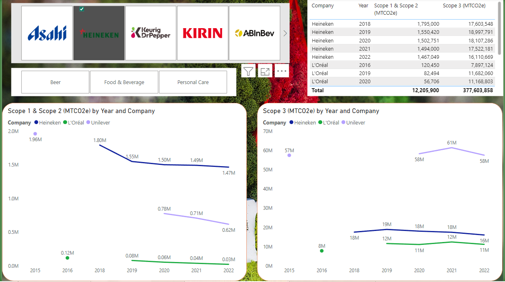
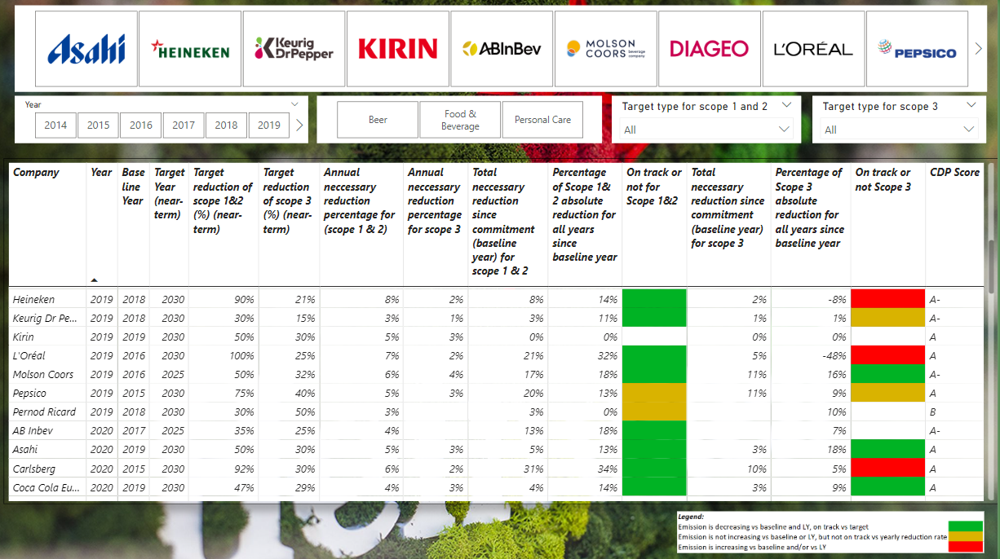
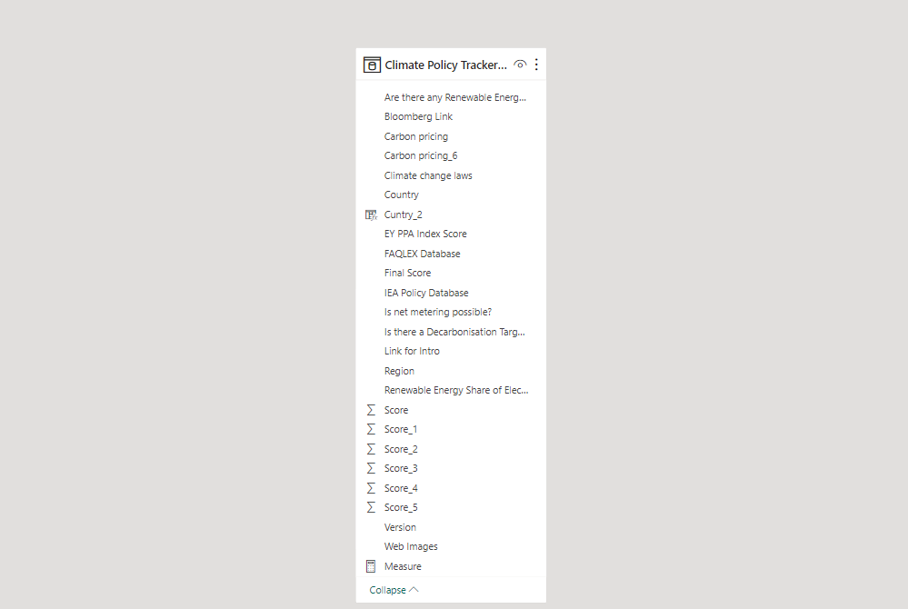
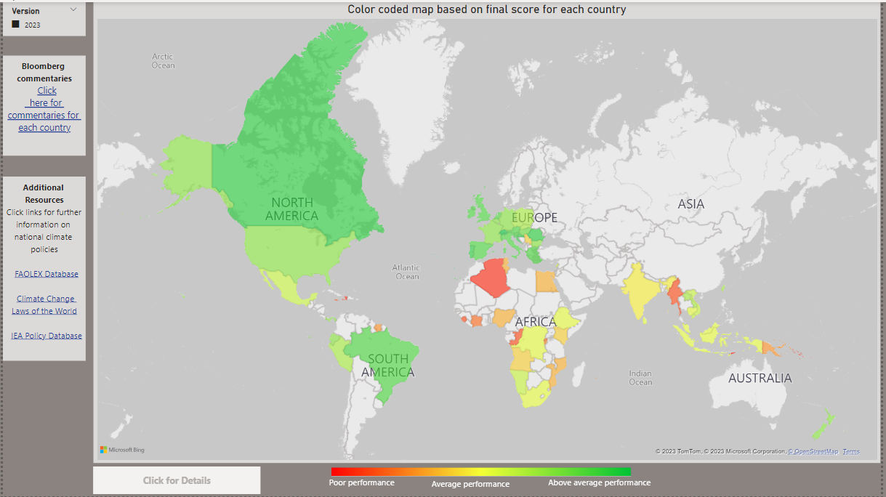
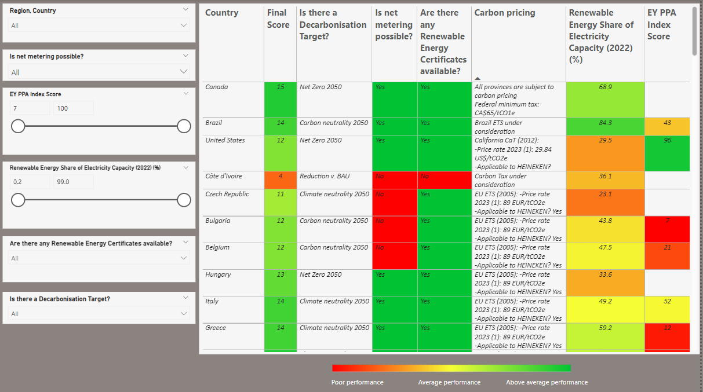
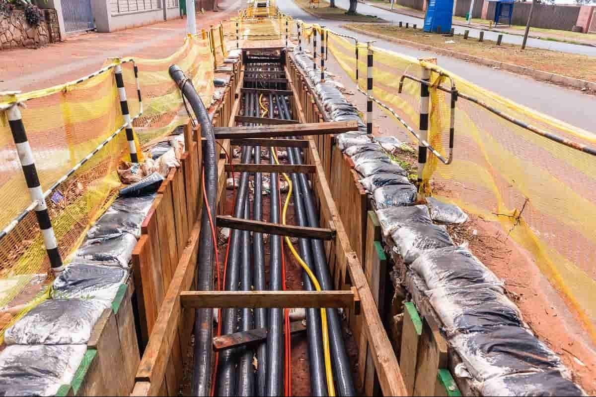

 ## Msc Biosystem Engineering thesis:
## The impact of precipitation on the performance of the BO3 reactor on removing micropollutants and organic matter from wastewater treatment plant effluent
# Thesis summary
Micropollutants (MPs) such as pharmaceuticals and pesticides are given attention recently due to their impact on aquatic life. Wastewater treatment plants (WWTPs) are considered to be one of the main sources of MPs discharge to the environment. In order to test MPs removal during different weather conditions, a biological reactor (BAC) and an ozone reactor (O3) were combined in (BO3) reactor. Since 99% of ozone reacts with OM, not the targeted MPs, this research is focused on OM removal. A daily filled tank of 50L from Bennekom WWTP effluent was spiked with 24 MPs at a concentration of 1 μg/L and used as a feed for the BO3 reactor. The BO3 was fed with an average flowrate of 1 ± 0.04 and 1.01 ± 0.02 L/h for O3 reactor. Three ozone dosages are applied (0.2, 0.4, 0.6 g O3/g TOC), then the removal of OM and MPs were measured. To investigate the precipitation effect, different samples for dry periods and rainy periods were analyzed and OM characteristics were quantified. The result showed that OM concentration in WWTP effluent is 22% higher for TOC during dry days compared to rainy days. The BAC removal of OM for five chosen dry days is 28% higher for UV254 absorbance in comparison to the most intense five rainiest days. Nevertheless, precipitation showed no effect on OM composition of WWTP effluent, thus it is not related to the lower removal in BAC during rainy periods. Nonetheless, the higher formation of fulvic-like OM in the BAC was accompanied by the increase of the OM removal in BAC, it was likely due to microbial conversion. As for resin fractions, the HI fraction was 47% TOC removed, HOA fraction was 52% TOC removed which is advantageous to decrease the interference for the ozonation of MPs. Additionally, MPs were detected at 35% higher concentrations during dry days in WWTP effluent compared to the intense rainiest days. Moreover, precipitation lower the BAC removal for MPs with 12% higher removal during dry days compared to the intense rainiest days with an average precipitation of (6.5mm). Ozonation resulted in 17% higher MPs removed by 0.6 and 0.4 g O3/g TOC and 16% higher by 0.2 g O3/g TOC during dry days than the intense rainiest days. Potentially, it is caused by the higher reactivity of ozone with MPs during dry days due to the higher MPs concentration in WWTP effluent during dry days. Generally, MPs and OM both resulted in lower removal by BAC and ozone treatment during rainy days compared to dry days.

* Figure 1: Set-up for the BO3 reactor. BR1 is the BAC and O3R is the ozone reactor.

# Research questions and objectives:
How does the removal of organic matter and micropollutants in BO3 is impacted by dry periods and rainy periods?

Followed by the sub-questions that are intended to help answer the main research question:
- What is the difference in WWTP effluent characteristics during dry and rainy periods?
- What is the removal percentage of OM in the BAC and BO3 reactor for both dry and rainy periods?
- What is the removal percentage of MPs in the BAC and BO3 reactor for dry and rainy periods?

## Experimental setup

* Figure 2: The spiked WWTP was aerated in the aerator. BR1 is the BAC reactor. O3R is the ozone reactor. S1 is the feed sample, S2 is the sample after BAC treatment, S3 is the sample after BO3 treatment and S4 is the sample after O3 treatment only.

- The followig figrue 3 represents the average removal of OMs for all dry days Vs rainy days, for different ozone dosages for BAC+O3 and only O3. Error bars represent standard deviation.

- The following figure 4 represents MPs removal with BAC+O3 Vs precipitation.

# Conclusion

In this study, the impact of precipitation on the removal of OM and MPs in BO3 reactor was studied. The result showed that OM concentration in WWTP effluent is 22% higher for TOC during dry days compared to rainy days. The BAC removal of OM was 17% higher for TOC, 21% COD, and 28% for UV254 absorbance compared to the intense rainiest days. The efficiency of the BAC for OM removal was increased over four months, the potential reason was the higher nutrient concentration in WWTP effluent for the first half period of the whole experiment. As for fluorescence measurement, precipitation showed no effect on OM composition of WWTP effluent, thus it is not related to the lower removal in BAC during rainy periods. Nevertheless, the higher formation of fulvic-like OM in the BAC was accompanied by the increase of the OM removal in BAC, it was likely due to microbial conversion. As for resin fractions, the HI fraction was 47% TOC removed, HOA fraction was 52% TOC removed which is advantageous to decrease the interference for the ozonation of MPs
Additionally, MPs were detected at 35% higher concentrations during dry days in WWTP effluent compared to the intense rainiest days. MPs after BAC treatment was removed to a higher extent during dry days by an average of 12% compared to the intense rainiest days with an average precipitation of (6.5mm). Ozonation resulted in 17% higher MPs removed by 0.6 and 0.4 g O3/g TOC and 16% higher by 0.2 g O3/g TOC during dry days than the intense rainiest days. Potentially, it is caused by the higher reactivity of ozone with MPs during dry days due to the higher MPs concentration in WWTP effluent during dry days. Generally, MPs and OM both resulted in lower removal by BAC and ozone treatment during rainy days compared to dry days.

 ______________________________________________________________________________________________________________________________________________________________________

## Global Sustainable Development Specialist at Heineken
### Net Zero Carbon Project

* Benchmark dashboard development
* Data Mappig
  
My primary task involved gathering data from various sources, including Heineken and other companies. These companies belonged to both the same industry and different industries, such as food and beverage, and cosmetics. I relied on the valuable insights provided in each company's carbon disclosure project report. This thorough approach enabled me to capture a broad and complete array of data, ranging from carbon emissions and energy consumption to waste management and water usage across the companies under consideration
First, gross global Scope 1 emissions (metric ton CO2 emissions) for each company and for each year, starting off the baseline year for each company that has committed to reduce their emissions and set a Science Based Target [SBTi] for their emission were gathered. Then, location-based, and market-based Scope 2 emissions (metric ton CO2 emissions) for each company and each year since baseline year for each company. 
Later, Scope 3 emissions were gathered under the same principles for all the categories for each company.
Furthermore, data was gathered from the CDP report and the annual report for the corresponding company for renewable energy generation (in MWh) for each source of energy (electricity, heat, cooling, steam), for each year starting off the baseline year for each company. Moreover, the consumption purchased or acquired from renewable and non-renewable (MWh) sources for electricity, heat, cooling, and steam were also collected from the same sources. Additionally, the consumption of fuel (excluding feedstock) from renewable and non-renewable energy was also gathered from the same sources. Lastly, the total gross generation and consumption of electricity, heat, cooling and steam (in MWh) for each company and each year from renewable and non-renewable sources were collected separately.

Moreover, qualitative data was also collected for the renewable energy technology types (e.g.: hydropower, renewable electricity, large hydropower (>25 MW), solar, wind, biogas, sustainable biomass and geothermal) for each company for the year of 2021. In addition, the data is collected for the tracking instrument used, such as International Renewable Energy Certificate [I-REC], Renewable Energy Guarantee of Origin [REGO], Guarantee of Origin [GO], and Green Electricity Certificate [GEC] for the same companies and the same year.

* Creating matrices and analyzing the data:
1.	The annual necessary reduction percentage for scope 1 & 2 is calculated by dividing the target reduction of scope 1 & 2 for each company by the number
2.	The percentage of scope 1 & 2 reduction for each year based on the baseline year. To calculate this, the emission for scope 1 & 2 for the baseline year is detected from the emission of scope 1 & 2 for the next year and divided by the baseline year emission until 2022.
3.	The total necessary reduction since commitment (baseline year) for scope 1 & 2. To create this matrix, the number of years since the baseline year for each company multiplied by the annual necessary reduction percentage for scope 1 & 2.
4.	In order to track each company’s performance year over year (YOY) and analyze the progress, the total necessary reduction since commitment (baseline year) for scope 1 & 2 is subtracted from the percentage of scope 1 & 2 reduction for each year.
5.	Important note: All the previous matrices were also created for scope 3.
6.	Most of the companies have set 100% target on renewable electricity by the end of each company's target year starting off the baseline year. Based on that, the total necessary reduction of non-renewable electricity for each year is calculated by dividing the final target on renewable electricity on the number of years between the baseline and the target year for each company. In which every year’s reduction is added up to the following year until the target year is reached.
7.	The renewable energy generation share (in %) was calculated by summing up all the different energy that is generated by the company from renewable and non-renewable sources (Electricity, heat, steam, cooling) for each year and divided by only the energy that is generated from renewable sources.
8.	A matrix for the renewable electricity share (in %) for each company and each year by dividing the consumption of purchased or acquired electricity from renewable sources on the total (Renewable and non-renewable) sources of the consumed or purchased electricity.
9.	Lastly, to track each company’s performance on renewable electricity, the renewable electricity share for each year is subtracted from the total necessary reduction for each year for the company.

## Model the data
Modeling the data in PowerBi is done by setting a collection of tables and building relationships between them, which enable the users (Heineken employee) to easily understand and explore the insight of the data. Developing a good data model was essential for my work during the internship, first to improve the understandability of the data, second, to increase the resilience to change in the future for the next person. Therefore, I tried to keep the model as simple as possible yet sufficient to show all the benchmark analysis and time intelligence analysis.

The goal was to understand the interlink between scope 1, 2 and 3 emissions of CO2 and all categories of scope 3, as well as the renewable energy sources, and carbon intensity for each company and each year and to run time intelligence analysis. To do so, the raw data was set to be the fact table in the model. Indeed, the fact table is the table that connect all the Dimension [Dim] tables in the model. 

All the Dim tables are connected to the fact table (with the raw data) by many relationships, meaning multiple records of dataset in the table (e.g., carbon intensity is mapped to multiple records in dataset). The relationship between the fact table (with the raw data) and the Target progress table (the table with the matrices) is set to be Bi-directional relations, meaning that any change in the raw data will impact the matrices and vice versa. As for the carbon intensity table, it was set to have a single relationship with the fact table (raw data), in which any change of the scope 1, 2 and 3 emissions should impact the carbon intensity performance.

## Data Visualization

The main purpose of this project is to show how each company is performing towards reducing carbon emissions for Scope 1, 2, and 3 for each year as well as building a time intelligence to track the performance year over year of benchmarking between companies. Additionally, it is useful to visualize the interlink between carbon emissions, renewable energy, and electricity consumption and generation for each company. It also is useful to show the type of renewable electricity technology that is used, also to visualize the tracking instrument utilize
In order to comprehensively build the main dashboard and make sure the data is displayed in the best manner and most helpful way for users, each dashboard is analyzed individually based on the purpose of the data that should be conveyed. For instance, the dashboard YOY trends of emissions is using a time intelligence function, in which visualizing the trend for each company year over year in terms of scope 1, 2, and 3 CO2 emissions.

* Scope 1,2 and 3

* YOY Trends of emissions

* Performance against targets Matrices

# Climate Policy Tracker dashoard Development

The Climate Policy Tracker proved to be a valuable tool, as it provided up-to-date and comprehensive insights into climate policies throughout all geographic areas in which Heineken is active. This level of transparency is vital for the Operating Companies and Global teams, as it keeps them informed about the evolving climate policy landscape that significantly impacts their respective markets. Through this dashboard, they gain a deeper understanding of the prevailing challenges and opportunities that characterize each State's climate initiatives, serving as a critical early step in shaping Heineken's advocacy strategy.

Academically, this task has been exceptionally enriching. Immersed in the intricacies of climate policy development and implementation, I improved my analytical skills and learned to interpret the implications of policy decisions on businesses and the environment. As I identified key indicators to assess countries' progress in terms of climate policies, I grasped the significance of measuring sustainability performance and the need for informed decision-making in corporate sustainability strategies. Moreover, this project exposed me to a diverse array of technologies and data-driven approaches in the context of sustainability and environmental management. By exploring real-world applications of PowerBi and data mapping techniques, I enhanced my proficiency in data visualization and analysis – valuable skills that will undoubtedly benefit my academic and professional pursuits.

Furthermore, the project's focus on global climate policies and the impact on multinational organizations like Heineken provided a deeper understanding of the complex interplay between environmental responsibility, corporate strategies, and public policy. It highlighted the importance of cross-sector collaboration and knowledge sharing to drive positive change on a global scale.

To model this data in PowerBi, one fact table was needed and no relationship in the model was used

For visualization, I was consistently receiving feedback from my team on the best way to show the data. We finally agreed to visualize it based on a color-coded map where each country that is represented by an OpCo which can colored based on the overall score of all indicators. The color gradient is spread between dark red to yellow and dark green, where the countries are colored based on the poorest performance for red color to average for yellow color and above average performance for green color.

* Overview Climate policy tracker map

* Country Details Table
______________________________________________________________________________________________________________________________________________________________________

# Project: Al-Kharj 128KV XLP Cable Laying

Project Overview:
As the Project Manager at Saudi Electricity Company, I spearheaded the successful execution of a significant infrastructure project involving the laying of 128KV XLP cables. This project aimed at enhancing the electrical grid infrastructure to ensure efficient electricity distribution across the region.

* Responsibilities and Achievements:

1- Team Management:
Led a dedicated team of 10+ engineer assistants and site workers throughout the project lifecycle.
Coordinated team efforts to ensure seamless communication and collaboration, fostering a positive and efficient working environment.

2- Project Planning and Execution:
Developed comprehensive project plans, outlining key milestones and deliverables.
Ensured the successful implementation of the project, adhering to strict timelines and quality standards.

3- Safety Compliance:
Prioritized safety as a top concern, meticulously planning and implementing safe layout and installation practices.
Ensured compliance with local guidelines, industry standards, and company safety policies.

4- Cross-functional Collaboration:
Collaborated effectively with cross-functional teams, including engineering, logistics, and safety departments.
Facilitated data-driven decision-making processes, enhancing the overall efficiency and effectiveness of the project.

5- Initiative Development:
Proactively identified areas for improvement and developed initiatives to address challenges and optimize project outcomes.
Introduced innovative solutions to enhance project performance and efficiency.

* Project Impact:
The successful completion of the 128KV XLP cable laying project had a significant impact on the electrical infrastructure, resulting in:

* Improved Distribution: Enhanced the efficiency of electricity distribution across the region, contributing to a more reliable and stable power supply.

* Compliance and Safety: Ensured compliance with local guidelines and safety policies, creating a secure working environment for the team and minimizing potential risks.

* Team Development: Nurtured a high-performing team, fostering collaboration, skill development, and a culture of excellence.

128KV XLP cable laying

